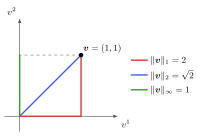
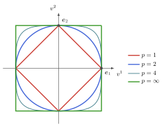
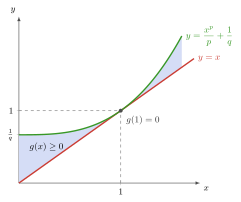
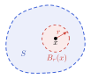
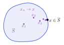
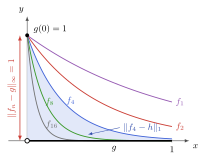
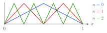

## Doel van dit hoofdstuk



In $\bbF^n$ is analyse vanzelfsprekend; in functieruimten niet.

Een **norm** geeft vectoren een lengte $\Rightarrow$ een notie van **afstand** in een vectorruimte
$$d(\vv, \vw) = \norm{\vv - \vw}$$

* **Analyse in vectorruimten**:
  * convergentie
  * continuïteit
  * volledigheid
* **Normen voor lineaire afbeeldingen**:
  * geïnduceerde norm
  * spectraalstraal
  * conditiegetal

# Genormeerde vectorruimten

## Norm

::: {.definitie nr="4.2"}
Gegeven een vectorruimte $V$. Een norm is een afbeelding $V \to \bbR : \vv \mapsto \norm{\vv}$ die voldoet aan

:::: {.columns}
::: {.column width="30%"}
absolute homogeniteit
:::
::: {.column width="70%"}
::: {style="text-align: center"}
$$\boxed{\norm{\scalara \vv} = \abs{\scalara} \norm{\vv}}$$
[$\Rightarrow \norm{\zerovec} = 0$]{style="color: grey; font-size: 85%"}
:::
:::
::::

:::: {.columns}
::: {.column width="30%"}
subadditiviteit / driehoeksongelijkheid
:::
::: {.column width="70%"}
::: {style="text-align: center"}
$$\boxed{\norm{\vv + \vw} \leq \norm{\vv} + \norm{\vw}}$$
[$\Rightarrow \norm{\zerovec} = 0 \leq \norm{\vv} + \norm{-\vv} = 2 \norm{\vv}$]{style="color: grey; font-size: 85%"}
:::
:::
::::

:::: {.columns}
::: {.column width="30%"}
positief definiet
:::
::: {.column width="70%"}
::: {style="text-align: center"}
$$\boxed{\norm{\vv} = 0 \Leftrightarrow \vv = 0}$$
:::
:::
::::
:::

Voor de eerste eigenschap hebben we op het veld van scalairen $\bbF$ een **absolute waarde** $\abs{\scalara}$ nodig. Voor $\bbR$ en $\bbC$ komt dit overeen met de gekende definitie. 

## Nuttige eigenschap

::: {.definitie nr="4.2"}
Gegeven een vectorruimte $V$. Een norm is een afbeelding $V \to \bbR : \vv \mapsto \norm{\vv}$ die voldoet aan

* absolute homogeniteit: $\norm{\scalara \vv} = \abs{\scalara} \norm{\vv} \Rightarrow \norm{\zerovec} = 0$
* subadditiviteit / driehoeksongelijkheid: $\norm{\vv + \vw} \leq \norm{\vv} + \norm{\vw} \Rightarrow \norm{\zerovec} = 0 \leq \norm{\vv} + \norm{-\vv} = 2 \norm{\vv}$
* positief definiet: $\norm{\vv} = 0 \Leftrightarrow \vv = 0$
:::

::: {.opmerking nr="4.2"}
$\norm{\vv} \leq \norm{\vw} + \norm{\vv - \vw}$ (uit driehoeksongelijkheid)

$\implies \norm{\vv} - \norm{\vw} \leq \norm{\vv - \vw}$
$\implies \abs{\norm{\vv} - \norm{\vw}} \leq \norm{\vv - \vw}$ (uit $\vv \leftrightarrow \vw$)
:::

## Voorbeelden:

::: {.voorbeeld nr="4.1"}
$V = \bbF^n$: $\norm{\vv} = \sum_{i=1}^n \abs{v^i}$
:::

::: {.voorbeeld nr="4.2"}
$V = \bbR^2$: $\norm{(x,y)} = \sqrt{x^2 + y^2}$
:::

::: {.voorbeeld}
$V = C(I,\bbF)$ voor een interval $I=[a,b] \subseteq \bbR$: $\norm{f} = \int_I \abs{f(x)}\,\drm x$ (zie later)
:::

## Hölder $p$-norm

::: {.definitie nr="4.3"}
Voor $V = \bbF^n$ hebben we een familie van normen

$$\norm{\vv}_p = \left[\sum_{i=1}^{n} \abs{v^i}^p\right]^{1/p}$$

Speciale gevallen:

* $p=1$: Manhattan norm
* $p=2$: Euclidische norm $\rightarrow$ zie volgend hoofdstuk
* limiet $p\to \infty$:
  $$\norm{\vv}_\infty = \max \{\abs{\vv^i}, i=1,\ldots,n\}$$
:::

## Hölder $p$-norm

:::: {.columns}
::: {.column width="50%"}
::: {style="height: 360px; display: flex; align-items: center; justify-content: center"}
{width="370px"}
:::
:::
::: {.column width="50%"}
::: {style="height: 360px; display: flex; align-items: center; justify-content: center"}
{width="440px"}
:::
:::
::::

:::: {.columns style="text-align: center; font-size: 85%"}
::: {.column width="50%"}
De "lengte" van $\vv = (1, 1)$ hangt af van de norm
:::
::: {.column width="50%"}
Eenheidssferen $\norm{\vv}_p = 1$ in $\bbR^2$ voor $p \in \{1, 2, 4, \infty\}$
:::
::::

## Hölder $p$-norm

* $\norm{\cdot}_p$ is absoluut homogeen en positief definiet per constructie.

* Beschouw $q = p/(p-1)$, zodat $1/p + 1/q = 1$:

  ::: {.lemma nr="4.1"}
  Young's ongelijkheid: $\forall a,b \in \bbR_{\geq 0}: ab \leq \frac{a^p}{p} + \frac{b^q}{q}$
  :::

  ::: {.lemma nr="4.2"}
  Hölder's ongelijkheid: $\sum_{i=1}^n \abs{v^i}\abs{w^i} \leq \norm{v}_p \norm{w}_q$
  :::

  ::: {.propositie nr="4.3"}
  Minkowski's ongelijkheid: $\norm{\vv+\vw}_p \leq \norm{\vv}_p + \norm{\vw}_p$
  :::

## Hölder $p$-norm

:::: {.columns}
::: {.column width="45%"}
::: {.lemma nr="4.1"}
Young's ongelijkheid:
$$\forall a,b \in \bbR_{\geq 0}: ab \leq \frac{a^p}{p} + \frac{b^q}{q}$$
:::
:::
::: {.column width="55%"}
{width="100%"}
:::
::::

## Hölder $p$-norm

::: {.lemma nr="4.1"}
Young's ongelijkheid:
$$\forall a,b \in \bbR_{\geq 0}: ab \leq \frac{a^p}{p} + \frac{b^q}{q}$$
:::

::: {.lemma nr="4.2"}
Hölder's ongelijkheid:
$$\sum_{i=1}^n \abs{v^i}\abs{w^i} \leq \norm{\vv}_p \norm{\vw}_q$$
:::

::: {.propositie nr="4.3"}
Minkowski's ongelijkheid:
$$\norm{\vv+\vw}_p \leq \norm{\vv}_p + \norm{\vw}_p$$
:::

## Hölder $p$-norm {.scrollable}

Uitbreiding naar oneindig-dimensionale ruimten:

::: {.definitie nr="4.4"}
$\boxed{\ell^p(\bbN_0,\bbF) \subspace \bbF^{\bbN_0}}$: de ruimte van alle rijen $(v^1,v^2,v^3,\ldots)$ waarvoor $\sum_{i=1}^{+\infty} \abs{v^i}^p$ convergeert naar een eindige waarde
:::

::: {.opmerking nr="4.5"}
* Minkowski's ongelijkheid is nodig om aan te tonen dat $\ell^p(\bbN_0,\bbF)$ een vectorruimte is
* norm $\norm{\vv}_p = \left[\sum_{i=1}^{+\infty} \abs{v^i}^p\right]^{1/p}$ is eindig
:::

::: {.opmerking nr="4.6"}
* speciaal geval $p=\infty$: $\norm{\vv}_\infty = \sup\{\abs{v^i}, i\in \bbN_0\}$ (supremum norm)
* $\ell^\infty(\bbN_0,\bbF)$: ruimte van begrensde rijen
:::

Bewijs van eigenschappen norm $=$ limiet $n\to\infty$ van bewijs voor $\bbF^n$.

## Hölder $p$-norm

Uitbreiding naar oneindig-dimensionale ruimten:

::: {.voorbeeld nr="4.3"}
Voor $V = C^0([a,b],\bbF)$: $\norm{f}_p = \left(\int_a^b \abs{f(x)}^p\,\drm x\right)^{1/p}$

* Continuïteit $f$ en compactheid van interval $[a,b]$ noodzakelijk
  * geen divergenties
  * $\norm{f}_p=0 \implies f=0$
* Driehoeksongelijkheid kan op analoge manier bewezen worden
* Meer over functies in H7
:::

## Metrische ruimten

::: {.definitie nr="4.5"}
Gegeven een verzameling $X$, een metriek of afstandsfunctie is een functie $d:X \times X \to \bbR_{\geq 0}$ met eigenschappen:

* $\boxed{d(x,y) = 0 \iff x=y}$
* $\boxed{d(x,y) = d(y,x)}$
* $\boxed{d(x,y) + d(y,z) \geq d(x,z)}$

en dan noemen we $(X,d)$ een metrische ruimte

$\rightarrow$ Niet noodzakelijk vectorruimte!
:::

::: {.propositie nr="4.4"}
Een genormeerde vectorruimte $(V,\norm{\cdot})$ wordt een metrische ruimte met de keuze $d(\vv,\vw) = \norm{\vv-\vw}$
:::

## Metrische ruimten {.scrollable}

Metrische ruimten $\Rightarrow$ veralgemenen van concepten uit analyse van functies $\bbR \to \bbR$:

* **Convergentie van een rij** $(x_n \in X)_{n \in \bbN_0}$
  $$\boxed{\lim_{n\to\infty} x_n = x \iff \lim_{n\to\infty} d(x_n,x) = 0}$$
  of dus: $\forall \epsilon > 0, \exists N_\epsilon \in \bbN_0$ zodat $n \geq N_\epsilon \implies d(x,x_n) \leq \epsilon$

* **Continuïteit van** $\Phi: (X,d_X) \to (Y,d_Y)$ in $x \in X$: $\Phi$ bewaart convergentie
  $$\boxed{\lim_{n\to\infty} d_X(x_n,x) = 0 \implies \lim_{n\to\infty} d_Y(\Phi(x_n),\Phi(x)) = 0}$$
  * Zonder rijen: $\forall \epsilon > 0, \exists \delta_\epsilon > 0:$ $d_X(x',x) < \delta_\epsilon \implies d_Y(\Phi(x'),\Phi(x)) < \epsilon$^[$\delta_\epsilon$ hetzelfde voor alle $x \in X$: "uniform continu"]
  * $\Phi$ **continu op** $X$: $\lim_{n\to\infty} \Phi(x_n) = \Phi(\lim_{n\to\infty} x_n)$ (continu in elke $x \in X$)

## Metrische ruimten

::: {.definitie nr="4.6"}
Een afbeelding $\Phi:X \to Y$ tussen metrische ruimten $(X,d_X)$ en $(Y,d_Y)$ is **isometrisch** als $d_Y(\Phi(x),\Phi(x')) = d_X(x,x')$ voor alle $x,x'\in X$
:::

::: {.opmerking nr="4.9"}
* Een isometrische afbeelding is automatisch (uniform) continu ($\delta_\epsilon = \epsilon$)
* Een isometrische afbeelding is automatisch injectief
* Een bijectieve isometrische afbeelding definieert een isomorfisme tussen $(X, d_X)$ en $(Y, d_Y)$
:::

## Metrische ruimten {.scrollable}

Topologische concepten in een metrische ruimte $(X,d)$:

:::: {.columns}
::: {.column width="72%"}
* **Open bol**: $\boxed{B_r(x) = \{x' \in X \mid d(x,x') < r\}}$
* **Open** (deel)verzameling $S$: $\boxed{\forall x \in S, \exists r > 0 : B_r(x) \subseteq S}$
* **Gesloten** deelverzameling $S$: $\boxed{S^\text{c} = X \setminus S \text{ open}}$
  * convergente rij $(x_n \in S)$ voldoet aan $\lim_{n\to\infty} x_n \in S$
  * $X$ en $\emptyset$ zijn zowel open als gesloten
* **Sluiting** $\overline{S}$: $\boxed{\text{kleinste gesloten verzameling die } S \text{ bevat}}$
  * $= S$ en al zijn limietpunten
* **Dichte** deelverzameling $S$: $\boxed{\overline{S} = X}$ (bvb: $\overline{\mathbb{Q}} = \bbR$)
* **Begrensde** verzameling $S$: $\boxed{\exists M \in \bbR_{\geq 0} : d(x,y) < M, \forall x,y \in S}$
* $X$ is **separabel**: $\boxed{X \text{ heeft een aftelbare dichte deelverzameling}}$
:::
::: {.column width="28%"}
{width="80%"}

{width="100%"}
:::
::::

## Continuïteit in genormeerde vectorruimte

Beschouw $(V,\norm{\cdot})$ als metrische ruimte met metriek $d(\vv,\vw) = \norm{\vv-\vw}$

::: {.propositie nr="4.5"}
De norm $\norm{\cdot}:V\to \bbR$ is zelf een continue afbeelding

::: {style="margin-left: 1.5em"}
$\Rightarrow$ voor $(\vv_n)$ convergent, is $(\norm{\vv_n})$ ook convergent
:::
:::

::: {.propositie nr="4.6"}
Vector optelling $+:V \times V \to V$ en scalaire vermenigvuldiging $\bbF \times V \to V$ zijn continue afbeeldingen^[Hiervoor hebben we het volgende nodig: de productverzameling $X \times Y$ van twee metrische ruimten $(X, d_X)$ en $(Y, d_Y)$ is metrische ruimte, bijvoorbeeld met metriek $d_{X,Y}((x,y), (x',y')) = d_X(x,x') + d_Y(y,y')$]
:::

## Convergentie in functieruimten {.scrollable}

::: {.voorbeeld nr="4.5"}
Beschouw opnieuw $C^0([a,b],\bbF)$ met nu de $p=\infty$-norm, welke zich herleidt tot:^[Extremumstelling van Weierstrass: $\sup$ wordt $\max$ voor continue $f$ begrensd interval $[a,b]$]

$$\norm{f}_p = \sup_{x\in [a,b]}\abs{f(x)} = \max_{x\in[a,b]}\abs{f(x)}$$

Convergentie: $\lim_{n\to \infty} f_n = f$ als

* $\max_{x\in [a,b]} \abs{f_n(x)-f(x)} < \epsilon$ voor alle $n > N_\epsilon$
* $\abs{f_n(x)-f(x)} < \epsilon$ voor alle $x \in [a,b]$ voor alle $n > N_\epsilon$
  * $\Rightarrow$ **uniforme convergentie** van een reeks
  * $\Rightarrow$ $\norm{f}_{\infty}$ voor continue functies wordt de uniform-norm genoemd
:::

::: {.voorbeeld nr="4.6"}
contrast met **puntsgewijze convergentie**:

$\abs{f_n(x)-f(x)} < \epsilon$ voor alle $n > N_{\epsilon,x}$ voor alle $x \in [a,b]$

kan niet worden bekomen met behulp van norm
:::

## Convergentie in functieruimten (voorbeeld)

Beschouw de rij $(f_n \in C^0([0,1],\bbR))_{n \in \bbN_0}$ met $f_n(x) = \exp(-n x)$

:::: {.columns}
::: {.column width="55%"}
* $(f_n)$ convergeert puntsgewijs naar de (niet-continue!) functie
  
  $g(x) = \begin{cases} 1, x=0 \\ 0, x \in (0,1]\end{cases}$
* $(f_n)$ convergeert volgens de $p=1$ norm naar de continue functie
  
  $h(x) = 0, \forall x \in [0,1]$
* $(f_n)$ convergeert niet volgens de $p= \infty$ norm
:::
::: {.column width="45%"}
{width="100%"}
:::
::::

## Equivalentie van normen {.scrollable}

::: {.definitie nr="4.7"}
Twee normen voor een vectorruimte $V$ zijn equivalent als ze aanleiding geven tot dezelfde definitie van convergerende rijen, met dan dezelfde limietpunten
:::

::: {.propositie nr="4.7"}
Twee normen $\norm{\cdot}_a$ en $\norm{\cdot}_b$ zijn equivalent als en slechts als er constanten $C \geq c > 0$ bestaan zodat $c \norm{\vv}_a \leq \norm{\vv}_b \leq C\norm{\vv}_a$ voor alle $\vv \in V$
:::

::: {.propositie nr="4.8"}
Voor een eindig-dimensionale vectorruimte $V$ zijn alle normen equivalent
:::

::: {.voorbeeld nr="4.8"}
Voorbeelden voor $\vec{v} \in \bbF^n$:

* $\frac{\norm{\vec{v}}_1}{\sqrt{n}} \leq \norm{\vec{v}}_2 \leq \norm{\vec{v}}_1$
* $\frac{\norm{\vec{v}}_1}{n} \leq \norm{\vec{v}}_\infty \leq \norm{\vec{v}}_1$
:::

Oneindige dimensie: $f_n(x) = e^{-nx}$ van de vorige slide

::: {style="margin-left: 1.5em"}
$\Rightarrow$ $\norm{f_n}_1 \to 0$ maar $\norm{f_n}_\infty = 1$: $\norm{\cdot}_1$ en $\norm{\cdot}_\infty$ niet equivalent op $C^0([0,1],\bbR)$
:::

# Banachruimten

## Cauchy rijen en compleetheid

::: {.definitie nr="4.8"}
Een **Cauchy-rij** in een metrische ruimte $(X,d)$ is een rij $(x_n \in X)_{n\in\bbN_0}$ zodat $\forall \epsilon >0: \exists N_\epsilon \in \bbN$ met dan $n,m > N_\epsilon \implies d(x_n,x_m) < \epsilon$

::: {style="margin-left: 1.5em"}
$\rightarrow$ intuïtief: elementen in de staart van de rij komen arbitrair dicht bij elkaar
:::
:::

::: {.propositie nr="4.10"}
Een convergente rij is altijd een Cauchy-rij
:::

::: {.definitie nr="4.9"}
Als elke Cauchy-rij convergeert wordt $X$ (metrisch) **compleet** genoemd
:::

::: {.definitie nr="4.10"}
Een genormeerde vectorruimte $(V,\norm{\cdot})$ die metrisch compleet is wordt een **Banachruimte** genoemd
:::

## Banachruimten

Voorbeelden:

::: {.opmerking nr="4.11"}
Elke eindig-dimensionale vectorruimte, met eender welke norm
:::

::: {.opmerking nr="4.12"}
Elke eindig-dimensionale deelruimte $W$ van een oneindig-dimensionale $V$, met de norm van $V$ beperkt tot $W$
:::

::: {.voorbeeld nr="4.9"}
De rijen met eindige $p$-norm, $\ell^p(\bbN_0,\bbF)$, voor alle $p \in [1,+\infty]$
:::

::: {.voorbeeld nr="4.10"}
De continue functies $C^0([a,b],\bbF)$ op een compact interval, met de uniforme norm $\norm{\cdot}_\infty$
:::

## Banachruimten

Tegenvoorbeeld:

::: {.voorbeeld nr="4.11"}
* Ruimte $\bbF[x]$ van polynomen met norm $\norm{p}= \max_{x \in [a,b]} \abs{p(x)}$
  * $p_n(x) = \sum_{k=0}^n \frac{1}{k!}x^k$ definieert een Cauchy-rij
  * $\lim_{n\to\infty} p_n$ bestaat niet als polynoom

* Herinterpreteer $\bbF[x]$ als (eigenlijke) deelruimte van $C^0([a,b],\bbF)$
  * $\lim_{n\to\infty} p_n = \exp$ bestaat als continue functie
  * $\Rightarrow$ een oneindige deelruimte van een Banachruimte is niet noodzakelijk gesloten
:::

## Banachruimten: complete verzameling

Oneindig-dimensionale deelruimten $W \subspace V$ niet per se gesloten

::: {style="margin-left: 1.5em"}
$\Rightarrow$ we kunnen hun sluiting $\overline{W}$ bekijken
:::

* Als $\overline{W}=V$, dan is $W$ een **dichte** deelruimte
  * Elke vector $\vv \in V$ kan arbitrair dicht benaderd worden door een vector $\vw \in W$
  * $\forall \epsilon > 0, \vv \in V : \exists \vw \in W$ zodat $\norm{\vv-\vw}<\epsilon$

::: {.definitie nr="4.11"}
Een verzameling $S$ waarvoor $\bbF S$ dicht is, of dus $\overline{\bbF S}=V$, wordt een **totale**, **fundamentele** of **complete** verzameling genoemd

(Contrast met H1: complete verzameling als $\bbF S = V$)
:::

## Banachruimten: complete verzameling

::: {.voorbeeld nr="4.12"}
Stelling van Stone-Weierstrass. Equivalente formuleringen:

* Elke continue functie kan arbitrair dicht (in uniform-norm) benaderd worden door een veelterm
* $\bbF[x]$ is een dichte deelverzameling van $C^0([a,b],\bbF)$
* $\{x^n, n=0,1,2,\ldots\}$ is een complete verzameling voor $C^0([a,b],\bbF)$
:::

## Banachruimten

Van rijen naar reeksen in genormeerde vectorruimten $(V,\norm{\cdot})$

::: {.definitie nr="4.12"}
Convergentie van reeksen: als rij van partieelsommen convergeert

$$\boxed{\sum_{n=1}^{+\infty} \vv_n = \vv \iff \lim_{n\to \infty} \norm{\sum_{k=1}^{n} \vv_k - \vv} = 0}$$
:::

::: {.definitie nr="4.13"}
Een reeks $\sum_{n=1}^{+\infty} \vv_n$ is **absoluut convergent** als de reeks $\sum_{n=1}^{+\infty} \norm{\vv_n}$ convergeert

(geen nodige voorwaarde voor convergentie)
:::

::: {.propositie nr="4.11"}
Een genormeerde vectorruimte is metrisch compleet (Banachruimte) als en slechts als absolute convergentie een voldoende voorwaarde is voor convergentie van een reeks.
:::

## Banachruimten en basis

Convergentie van rijen en reeksen laat een nieuw concept van basis toe in Banachruimten $(V,\norm{\cdot})$

::: {.definitie nr="4.14"}
Een *Schauder basis* is een rij $(\ve_n \in V)_{n \in \bbN_0}$ zodat voor elke vector $\vv \in V$ een rij van coefficiënten $(a^n \in \bbF)_{n \in \bbN_0}$ bestaat, zodat $\sum_{n=1}^{+\infty} a^n \ve_n = \vv$
:::

::: {.voorbeeld nr="4.13"}
De rij $(x^n)_{n \in \bbN}$ is **geen (!!)** Schauder basis voor $(C^0([a,b],\bbF), \norm{\cdot}_{\infty})$:

* een reeks $\sum_{n=0}^{+\infty} a_n x^n$ die convergeert met betrekking tot $\norm{\cdot}_{\infty}$ (uniforme convergentie) geeft sowieso aanleiding tot een analytische functie

* een niet-analytische continue functie zoals $\abs{x}$ heeft geen Taylorreeks die in het volledige interval convergent is
:::

$\Rightarrow$ allerlei technische subtiliteiten die verdwijnen in het geval van Hilbertruimten (zie volgend hoofdstuk)

::: {.absolute top="0" right="0" style="text-align: center;"}
{width="200px"}

[Wél een Schauder basis: Faber–Schauder-hoedjes]{style="color: grey; font-size: 60%"}
:::

# Normen voor lineaire afbeeldingen

## Normen voor matrices

Gegeven $\mat{A} \in \bbF^{m \times n}$: 

* 'vectoriseer' $\mat{A}$ (vergeet de matrixstructuur) via $\bbF^{m \times n} \cong \bbF^{m n}$ (vectorruimte-isomorphisme) en gebruik een vectornorm

::: {.definitie nr="4.15"}
Frobenius norm (ook wel Hilbert-Schmidt norm):

$$\boxed{\norm{\mat{A}}_\text{F} = \left(\sum_{i=1}^{m}\sum_{j=1}^{n} \abs{A^i_{\ j}}^2\right)^{1/2} = \sqrt{\tr(\mat{A}^\hermitian \mat{A})}}$$
:::

* Normen met extra nuttige eigenschappen voor lineaire afbeeldingen?

## Continuïteit van lineaire afbeeldingen

Beschouw genormeerde vectorruimten $(V,\norm{\cdot}_V)$ en $(W,\norm{\cdot}_W)$.

::: {.definitie nr="4.16"}
Een lineaire afbeelding $\map{A}\in \Hom(V,W)$ wordt **begrensd** genoemd als er een constante $C \in \bbR_{\geq 0}$ bestaat zodat
$$\norm{\map{A}\vv}_W\leq C \norm{\vv}_V,\quad\forall \vv\in V$$
:::

::: {.propositie nr="4.12"}
Voor een lineaire afbeelding $\map{A}\in \Hom(V,W)$ zijn volgende eigenschappen equivalent

* $\map{A}$ is begrensd
* $\map{A}$ is continu in de oorsprong
* $\map{A}$ is overal continu (en zelfs uniform continu)
:::

## Begrensde lineaire afbeeldingen

::: {.definitie nr="4.17"}
We definiëren $\mathcal{B}(V,W) \subspace \Hom(V,W)$ als de ruimte van begrensde lineaire afbeeldingen tussen genormeerde vectorruimten $(V,\norm{\cdot}_V)$ en $(W,\norm{\cdot}_W)$.

* $\mathcal{B}(V,W)$ vormt inderdaad een vectorruimte (een deelruimte van $\Hom(V,W)$): tracht dit zelf aan te tonen!
:::

::: {.propositie nr="4.13"}
Als het domein $V$ een eindig-dimensionale ruimte is, geldt $\mathcal{B}(V,W)=\Hom(V,W)$
:::

::: {.definitie nr="4.18"}
Een norm $\norm{\map{A}}$ voor lineaire afbeeldingen $\map{A}\in \mathcal{B}(V,W)$ heet **ondergeschikt** (subordinate) aan de vectornormen in $V$ en $W$ als
$$\norm{\map{A}\vv}_W \leq \norm{\map{A}} \norm{\vv}_V,\quad\forall \vv \in V$$
:::

## Geïnduceerde norm

::: {.definitie nr="4.19"}
Beschouw genormeerde vectorruimten $(V,\norm{\cdot}_V)$ en $(W,\norm{\cdot}_W)$. We kunnen een norm voor afbeeldingen $\map{A}\in \mathcal{B}(V,W)$ definiëren via

\begin{align}
\norm{\map{A}}_{V \to W} &= \inf\{ C | 	\norm{\map{A} \vv}_W \leq C \norm{\vv}_V, \forall \vv \in V\}\nonumber\\
&= \sup\left\{\frac{\norm{\map{A}\vv}_W}{\norm{\vv}_V}\ \text{with}\ \vv \neq \zerovec_V\right\}\nonumber\\
&= \sup\{ \norm{\map{A}\vv}_W \text{with}\ \norm{\vv}_V = 1\}
\end{align}

Deze norm staat gekend als de **geïnduceerde norm** of soms ook **operator norm** (ook al geldt hij voor algemene lineaire afbeeldingen). Soms wordt ook met de "subordinate norm" specifiek naar deze definitie verwezen.
:::

## Geïnduceerde norm

::: {.propositie nr="4.14"}
Voor $(V, \norm{\cdot}_V)$ een genormeerde ruimte en $(W,\norm{\cdot}_W)$ een Banachruimte geldt dat de ruimte $\mathcal{B}(V,W)$ van begrensde lineaire afbeeldingen in combinatie met de geïnduceerde norm $\norm{\cdot}_{V\to W}$ zelf een Banachruimte is
:::

## Normen voor lineaire operatoren

Beschouw nu specifiek $\map{A}\in \End(V)$ voor een Banachruimte $(V,\norm{\cdot}_V)$. De begrensde lineaire operatoren worden genoteerd als $\mathcal{B}(V) = \mathcal{B}(V,V) \subspace \End(V)$.

::: {.definitie nr="4.20"}
Een norm $\norm{\cdot}$ voor lineaire operatoren wordt **submultiplicatief** genoemd als
$$\norm{\map{A}\cdot\map{B}} \leq \norm{\map{A}} \norm{\map{B}}, \quad \forall \map{A},\map{B} \in \mathcal{B}(V)$$
:::

::: {.propositie nr="4.15"}
De geinduceerde norm $\norm{\map{A}}_{V\to V}$ is submultiplicatief
:::

::: {.voorbeeld nr="4.14"}
Voor elke submultiplicatieve of ondergeschikte norm geldt $\norm{\idmap} \geq 1$. Voor de geinduceerde norm is $\norm{\idmap}=1$.
:::

## Normen voor matrices {.scrollable}

* $p$-norm vormt een familie van normen voor vectoren in $\bbF^n$ voor arbitraire $n$

::: {.voorbeeld nr="4.15"}
Voor $\mat{A}\in\bbF^{m \times n}$: geïnduceerde norm $\norm{\map{A}}_{p\to q}$ voor $p$-norm op $\bbF^m$ en $q$-norm op $\bbF^n$ (typisch willen we $p=q$)

* $$\norm{\mat{A}}_{\text{col}} = \norm{\mat{A}}_{1 \to 1} = \max_{j=1,\ldots,n} \sum_{i=1}^{m} \abs{A^i_{\ j}}$$

* $$\norm{\mat{A}}_{\text{row}} = \norm{\mat{A}}_{\infty \to \infty} = \max_{i=1,\ldots,m} \sum_{j=1}^{n} \abs{A^i_{\ j}}$$

(oefeningen, zelf proberen)
:::

::: {.voorbeeld nr="4.16"}
$\norm{\mat{A}}_{2 \to 2}$ is moeilijker te berekenen, en is gegeven door de grootste "singuliere waarde" (zie H6)
:::

## Consistente matrixnormen

::: {.definitie nr="4.21"}
Gegeven een familie van normen $\{\norm{\cdot}^{(m \times n)}: \bbF^{m\times n} \to \bbR_{\geq 0}; \forall m, n \in \bbN\}$ voor matrices van alle groottes:

* deze worden **consistent** genoemd als 
$$\norm{\mat{A}\mat{B}}^{(m \times n)} \leq \norm{\mat{A}}^{(m \times k)} \norm{\mat{B}}^{(k \times n)}$$
voor alle $\mat{A}\in\bbF^{m\times k}$ en $\mat{B}\in\bbF^{k\times n}$
:::

::: {.propositie nr="4.16"}
De normen $\norm{\mat{A}}_{p\to p}$ zijn consistent
:::

::: {.propositie nr="4.17"}
De norm $\norm{\mat{A}}_{\text{F}}=\norm{\text{vectorize}(\mat{A})}_2$ is consistent
:::

::: {.opmerking nr="4.22"}
De norm $\norm{\text{vectorize}(\mat{A})}_\infty$ is niet consistent
:::

## Matrixnormen: terminologie

::: {.opmerking nr="4.21"}
Het concept "matrixnorm" wordt vaak gedefinieerd als een norm die voldoet aan

* de drie voorwaarden van een vectornorm
* de consistentievoorwaarde
:::

::: {.opmerking nr="4.19"}
De consistentievoorwaarde is een veralgemening van submultiplicativiteit van operatornormen.
:::

* Er is geen gestandaardiseerde terminologie en "subordinate", "submultiplicative" en "consistent" of ook "compatible" wordt door elkaar gebruikt

## Spectraalstraal {.scrollable}

::: {.definitie nr="4.22"}
De spectraalstraal van een operator $\map{A}\in\End(V)$ is gedefinieerd als
$$\rho_{\map{A}} = \sup\{\abs{\lambda};\lambda \in \sigma_{\map{A}}\}$$
:::

::: {.propositie nr="4.18"}
Voor een submultiplicatieve norm en $V$ eindig-dimensionaal geldt $\norm{\map{A}} \geq \rho_{\map{A}}$
:::

::: {.opmerking nr="4.24"}
* ook $\rho_{\map{A}}^n \leq \norm{\map{A}^n}$
* als $\map{A}$ inverteerbaar: $\norm{\map{A}}^{-1}\leq \rho_{\map{A}}^{-1} \leq \norm{\map{A}^{-1}}$
:::

::: {.propositie nr="4.19"}
Gelfand formule: $\rho_\map{A} =\lim_{n\to\infty}\norm{\map{A}^n}^{\frac{1}{n}}$
:::

# Toepassingen

## Functies van matrices en operatoren

* Functie met convergente Taylorreeks rond $z=0$:
  $$f(z) = \sum_{n=0}^{+\infty} f_n z^n, \quad \forall \abs{z}<R$$

  * $\map{A}\in\mathcal{B}(V)$ met submultiplicatieve operatornorm:
    $$\norm{\sum_{n=0}^{+\infty} f_n \map{A}^n} \leq \sum_{n=0}^{+\infty} \abs{f_n} \norm{\map{A}^n} \leq \sum_{n=0}^{+\infty} \abs{f_n} \norm{\map{A}}^n$$

    ::: {style="margin-left: 1.5em"}
    $\Rightarrow$ $\sum_{n=0}^{+\infty} f_n \map{A}^n$ convergeert als $\norm{\map{A}}<R$ en $V$ een Banachruimte is
    :::

* Nilpotent $\map{N}$ ($\map{N}^s = 0$): voor elke $R > 0$ bestaat een norm met $\norm{\map{N}}_{R,s} < R$

  ::: {style="margin-left: 1.5em"}
  $\Rightarrow$ het normcriterium hangt af van de keuze van norm
  :::

## Sensitiviteit van lineaire systemen

Lineair systeem $\map{A}\vx = \vy$ met $\vx,\vy \in V$ en $\map{A} \in \End(V)$ met $V$ een genormeerde vectorruimte met norm $\norm{\cdot}$

* Stel kleine **variatie** $\vy \to \vy + \Delta\vy \Rightarrow \vx \to \vx + \Delta \vx$

::: {.definitie nr="4.23"}
$\frac{\norm{\Delta \vx}}{\norm{\vx}} \leq \kappa(\map{A}) \frac{\norm{\Delta\vy}}{\norm{\vy}}$

met het **conditiegetal $\kappa(\map{A})$** gegeven door

$$\kappa(\map{A}) = \begin{cases}
 \norm{\map{A}}\norm{\map{A}^{-1}},&\text{als $\map{A}$ inverteerbaar}\\
 +\infty,&\text{anders}
 \end{cases}$$

met hierin $\norm{\map{A}}$ de geïnduceerde norm geassocieerd aan de vectornorm

:::

## Sensitiviteit van lineaire systemen {.scrollable}

* Ook **variatie** $\map{A}\to \map{A}+\Delta\map{A}$, met $\norm{\map{A}^{-1}\Delta\map{A}} < 1$:
  $$\norm{(\map{A} + \Delta\map{A})^{-1}} \leq \frac{\norm{\map{A}^{-1}}}{1 - \norm{\map{A}^{-1} \Delta\map{A}}}$$

  ::: {style="margin-left: 1.5em"}
  $\Rightarrow$ samen met variatie $\Delta\vy$:
  :::
  $$\boxed{\frac{\norm{\Delta \vx}}{\norm{\vx}} \leq \frac{\kappa(\map{A})}{1 - \norm{\map{A}^{-1} \Delta\map{A}}} \left( \frac{\norm{\Delta \vy}}{\norm{\vy}} + \frac{\norm{\Delta\map{A}}}{\norm{\map{A}}}\right)}$$

* **A posteriori** fout van benaderde oplossing $\tilde{\vx}$ (exact: $\vx$), via **residu** $\vect{r} = \vy - \map{A}\tilde{\vx}$:
  $$\boxed{\frac{\norm{\vx - \tilde{\vx}}}{\norm{\vx}} \leq \kappa(\map{A}) \frac{\norm{\vect{r}}}{\norm{\vy}}}$$
